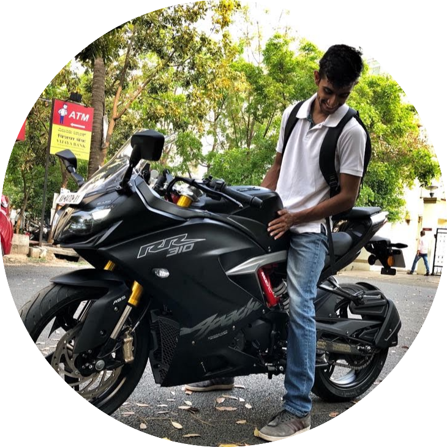
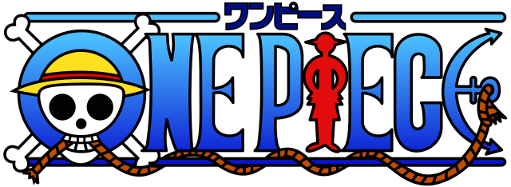

# ABOUT ME

I'm Karan George from Bangalore, India. I'm currently pursuing my Masters in CS at UIUC.
Three things that I am all about are

- Motorcycles
- Technology for social good
- Friends that become family

## Where I'm from ? 

Born and bought up in **Bangalore** India, I am the definition of Bangalorian. I am proud to come from the city that is known as the silicon valley of India.
Bangalore is a multicultural technology hub, I have worked and made lifelong friends who hail from different parts of the country.
If you or your friends are ever in Bangalore HIT ME UP and I'll tell you the best spots to grab an amazin breakfast, explore the city and end the night in amazing pubs that are designed to wow you !!!.

## My Journey in Technology

My journey in technology started in the 10th grade when I was introduced to C++ as a programming language. It sparked my interest and curiosity in the world of coding and software development.

During my undergraduate studies, I spent a few years exploring various fields to find something I was truly passionate about. It was during this time that I had the opportunity to lead an NGO called School Tree Project. Through this experience, I witnessed firsthand how technology can empower children, especially those with disabilities. It ignited a passion within me for using technology to make a positive impact on society.

## Tech for Social Good

Motivated by this realization, I decided to take on "Tech for Social Good" as my mantra. I wanted to leverage my skills and knowledge in technology to address social challenges and create meaningful change.

- Participated in JP Morgan's hackathon, CODE FOR GOOD
- Developed innovative technological solutions for social causes
- Enhanced my technical skills through collaboration with talented individuals

## Professional Experience

As a result of my participation in CODE FOR GOOD, I was offered a job at a prestigious firm, where I had the privilege to work on projects that aligned with my passion for using technology to drive positive social change.

## Hobbies

In addition to my love for technology, I have diverse interests and hobbies that bring joy and balance to my life:

### Motorcycling

I am an avid motorcyclist and have embarked on thrilling adventures across various South Indian states. Exploring the scenic landscapes and winding roads on my motorcycle has been an exhilarating experience. One of my ultimate dreams is to conquer the highest motorable road in India, Khardungla. The challenge and the breathtaking views that await on this journey motivate me to continue honing my riding skills and planning for this epic ride.

### Anime Enthusiast

Being an anime fan has been a significant part of my life. I have delved into a wide range of shonen anime series, including Naruto, Bleach, and One Piece. Among them, One Piece holds a special place in my heart. Its compelling storyline, rich character development, and the spirit of adventure have captivated me. The journey of Monkey D. Luffy and his crew as they search for the ultimate treasure, the One Piece, has inspired me to embrace the values of friendship, resilience, and pursuing dreams against all odds. I find immense joy and entertainment in diving into the vibrant and imaginative world of anime.

These hobbies not only provide me with moments of excitement and leisure but also serve as a source of inspiration and personal growth. They remind me of the importance of pursuing passions outside of the professional realm and embracing diverse experiences.

## Current Endeavors

Currently, I am a student at the University of Illinois at Urbana-Champaign (UIUC), where I am further expanding my knowledge in software engineering and web application development. Some of my ongoing pursuits include:

1. Learning advanced programming languages such as Python and JavaScript
2. Exploring cloud computing and machine learning
3. Engaging in open-source projects and contributing to the tech community

## Making a Difference

I am deeply committed to making a difference in the world and believe that technology can play a vital role in creating a more inclusive and equitable society. My long-term goal is to bridge the socio-economic gap in India through the power of technology.

> "Be the change you wish to see in the world." - Mahatma Gandhi