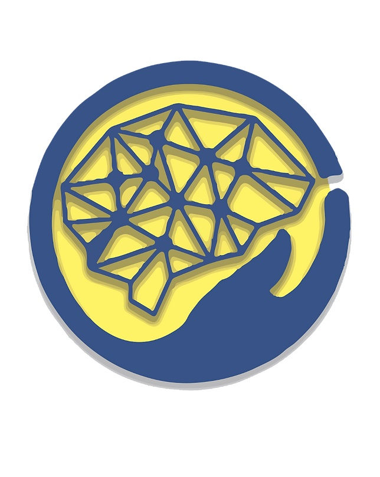
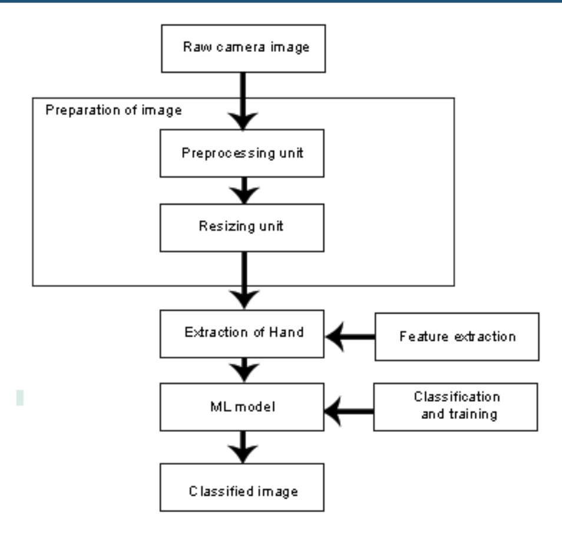
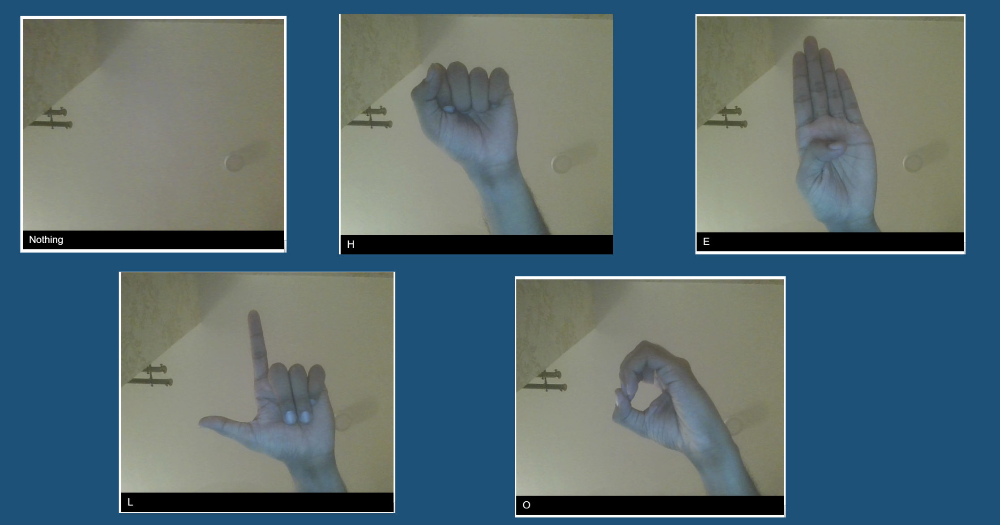

# SignSense

Assistive application for the differently abled was aimed at bridging the communication gap between the blind and the deaf by converting sign language to speech and text.
The project placed second among 120 at the senior project exhibition conducted by the Ramaiah Institute of Technology

*[Link to IEEE paper ](https://ieeexplore.ieee.org/document/9012843)*

## Methodology:
It incorporates a 3-way translation technique.
- Firstly, sign language can be converted to speech as well as text using image processing to effectively help the mute to communicate with others, especially if people are not well-versed with sign language.
- Further, the deaf can use the text and image components to read and understand.
- Lastly, the above will help the blind as well as it incorporates a speech component.

## General Architecture

## Detailed Desgin 
Transfer learning using MobileNet
- No preprocessing required

### Network description

- Initially trained on ImageNet dataset.
- Features extraction based on ImageNet dataset.
- 3 channel (RGB) input of size 224x224 pixels.
- The network uses relu as the final activation function.
- Trained on  American Sign Language dataset that consists of 29700 images for 10 letters used for classification.
- Test set consists of 300 images.

## Output 

