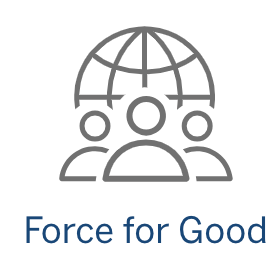

# Bal Utsav

Designed and implemented a scholarship module using Salesforce for a leading non-profit organization in India 'Bal Utsav'.
Automated the scholarship process allowing Bal Utsav to scale their scholarship program to 10,000 students across the country.

[Link to program](https://balutsav.org/programs-for-education-of-children/student-scholarships/)
## Project Details 
The team built out a salesforce module that leveraged the free liscenses provided to non profit organizations. The module performed the following functions
- Easy UI for creating new entries for students eliminating the manual paper driven method
- Tracking a students status within the system and identifying next steps
- Automated scoring based on predetermined rules that reduced manual effort 
- 
## Force for good
I took on the role of team lead within JP Morgan's [Force for good](https://www.jpmorganchase.com/impact/people/mentoring-skilled-volunteerism/tech-for-social-good). Where I led a team of developers to implement a salesforce solution for this problem.

