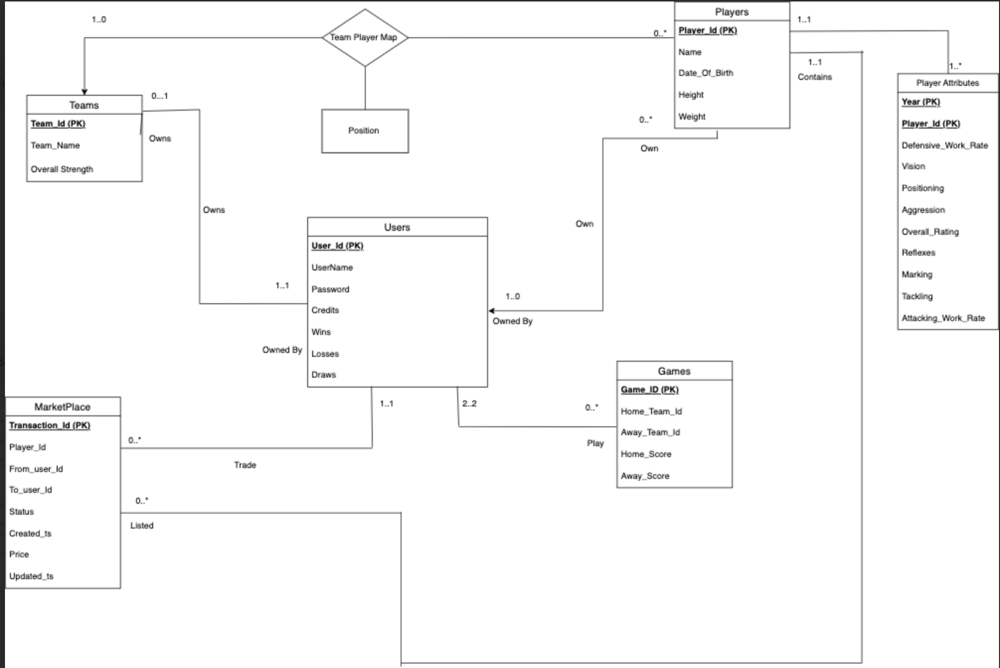

# Football Frenzy
Fantasy football website that contains data of over 1200 European players each with 25 player stat values. Users can form their own teams, trade on a marketplace, and simulate games against each other. Built as a part of a Database Systems project, the application leverages complex SQL techniques to maintain data hosted on GCP.

*Link to code [Github](https://github.com/karangeorge97/fa22-cs411-Q-team069-Nice)*

## Detailed Description
### Users
The critical component of the application, each user will be associated with a unique name they will use to identify themselves. On initial login, each user is set up with a certain amount of in-game credits they can use to build out their team. Users can then buy and sell players either to their friends or from the system; additionally, they will be able to purchase currency from the application to spend on acquiring players that they want.
Team formation
The most heavily interacted component of the application, team formation, will involve browsing through a list of players and applying various filters to find the right fit for a position on the team. Once users have the right player for a position, the player is saved as part of their team. Again, this will be a highly adjustable functionality, with most user interactions happening on this screen.

### Application Internals
Once a team is selected and saved, the application will use internal protocols to determine team chemistry and overall team stats such as offensive, midfielder, and defensive capabilities and assign an overall team rating that will not be available to the user. This team rating will be used to compete with friends.
### Simulated Matches
Our application will be able to simulate matches between teams created by users. The outcome of these matches will be determined from the attributes of each team. Participants will be awarded with in game credits which can be used to purchase better players.
### Marketplace
Our application will allow users to buy and sell players for the prices they quote on the marketplace. This system is in place to allow users to replenish their in game credits by strategically placing high valued players on the market.

## ER Diagram

## Output
[Youtube Teaser](https://www.youtube.com/watch?v=HTnme-yeIU4)

