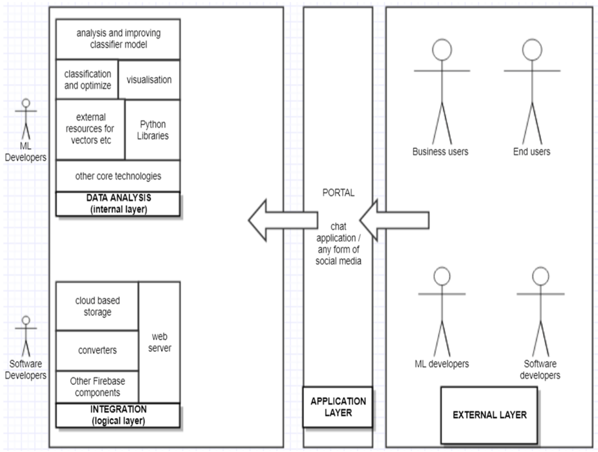
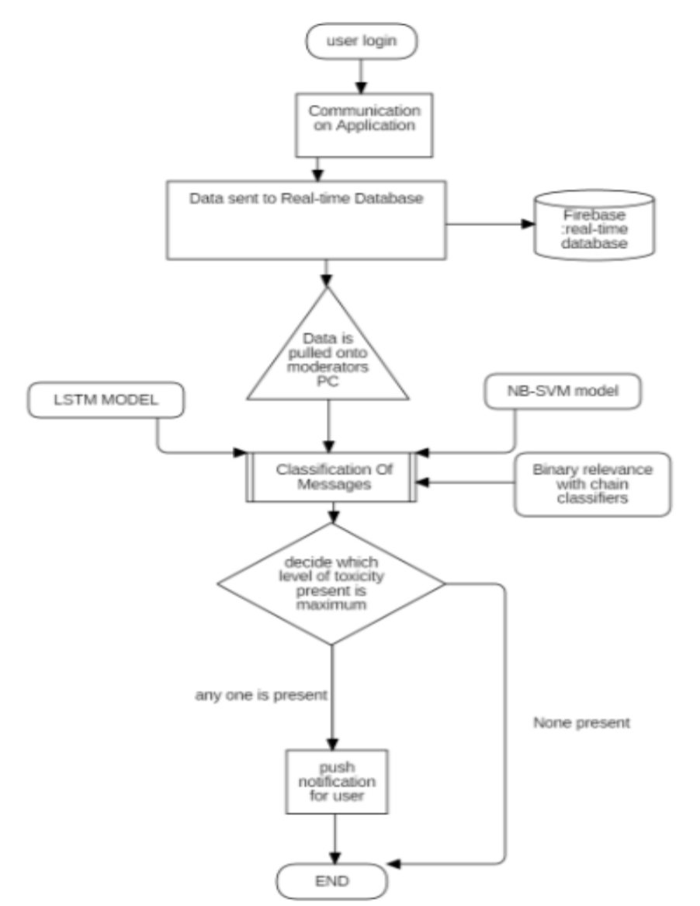

# Friendly Chat
An application to monitor the use of abusive and vulgar language on chats on social media networks to prevent users from being obscene can play a part in modifying the way users interact with each other. “Friendly chat” is a play on a group chatting application, users can discuss a range of topics that is completely unrestricted. When things start heating up a user may become abusive towards other users, at times like this the application will quickly diffuse the situation by deploying preventive measures, stopping the abusive user in his tracks.

## System Architecture

## Data flow diagram

## ML Algorithms used 
- Naive bayes model
- LSTM
- Binary relevance and chain classifiers
